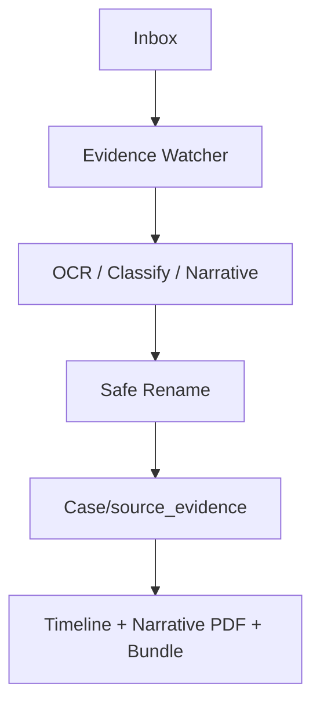

# MITCHOPOLIS MASTER CHEAT SHEET v2.0  
Comprehensive • Best-Practice Aligned • Watson v. McClean (BCSC File 138865)

---

## 1. TERMINAL WORKFLOW (CONTROL + LOG)

### CONTROL Terminal (left)
Run all commands here:

```
cd ~/Mitchopolis/evidence_engine
source .venv/bin/activate
```

### LOG Terminal (right)
Displays server logs only.  
Never run commands here.

---

## 2. START & STOP THE EVIDENCE ENGINE

### Start server
```
./scripts/run_evidence_api_dev.sh
```

### Hard stop
```
CTRL+C
pkill -f uvicorn
pkill -f python
```

---

## 3. CASE ALIGNMENT REVIEW (MANDATORY DAILY)

**Active Case:**

Watson v. McClean  
BCSC File 138865  
`ACTIVE_CASE_ID = BCSC_138865_Watson_v_McClean`

Before ingesting evidence, confirm:
- Case folder exists  
- Evidence Engine running  
- Swagger open: http://127.0.0.1:8000/docs  
- Inbox path correct  
- Routing logic intact  
- Tests passing (`pytest -q`)

---

## 4. EVIDENCE ENGINE — KEY COMMANDS

### Upload file to inbox  
Endpoint: `POST /ingest-file`

Saved to:
`~/Mitchopolis/parenting_evidence/inbox`

### Process evidence  
Endpoint: `POST /process`

Returns:
- OCR text
- Predicted type
- Timestamp
- Narrative
- Timeline entry
- Renamed + routed `media_path`

---

## 5. EVIDENCE ROUTING & NAMING STANDARD v1.0

### Routing Flow:
Inbox → OCR → Rename → Move → Case/source_evidence

### Safe filename format:
`YYYY-MM-DD_TYPE_UID.ext`

### Destination:
`~/Mitchopolis/cases/BCSC_138865_Watson_v_McClean/source_evidence/`

### Not moved if:
- OCR failed  
- Bad file type  
- `.DS_Store`  
- Missing extension  

---

## 6. FOLDER ARCHITECTURE

```
~/Mitchopolis
 ├── evidence_engine/
 ├── legal_ai_engine/
 ├── docs/
 │    ├── logs/
 │    ├── cheat_sheets/
 │    ├── architecture/
 │    │     └── diagrams/
 │    └── README.md
 ├── parenting_evidence/inbox/
 └── cases/BCSC_138865_Watson_v_McClean/
       ├── source_evidence/
       ├── bundles/
       ├── exports/
       ├── notes/
       └── filings/
```

---

## 7. NARRATIVE ENGINE

Item-level narrative included in `/process`.

### Master Narrative PDF:
`POST /narrative/master/pdf?case_id=BCSC_138865_Watson_v_McClean`

Payload must be a list of timeline entries.

PDF saved to:
`cases/.../exports/`

---

## 8. COURT BUNDLE v2.1

### Generate:
```
GET /bundle?case_id=BCSC_138865_Watson_v_McClean&folder=<absolute_path>
```

Bundle includes:
- exhibits/
- raw/
- timeline.csv
- index.md
- metadata

Saved to:
`cases/.../bundles/`

---

## 9. EVIDENCE WATCHER PROTOCOL v1.0

Watcher functions:
- `scan_inbox()`
- `should_process_file()`
- `process_file()`

Responsibilities:
- detect new inbox files  
- skip dotfiles  
- safe rename  
- move → case/source_evidence  
- append → `~/Mitchopolis/logs/evidence_watcher.log`

Watcher v1 does **not** perform OCR.

---

## 10. PYTEST COMMAND RULES (ZSH-SAFE)

### Specific tests:
```
pytest -q tests/test_routing.py
pytest -q tests/test_narrative_generation.py
pytest -q tests/test_timeline_date_extraction.py
pytest -q tests/test_court_bundle.py
pytest -q tests/test_evidence_watcher.py
```

### Full suite:
```
pytest -q
```

### DO NOT DO THIS:
```
pytest -q tests/test_routing.py  # comment breaks zsh
```

### Correct:
```
pytest -q tests/test_routing.py
# comment here
```

---

## 11. RESTART & HOTFIX COMMANDS

```
pkill -f uvicorn
pkill -f python
cd ~/Mitchopolis/evidence_engine
source .venv/bin/activate
./scripts/run_evidence_api_dev.sh
```

---

## 12. TROUBLESHOOTING

### “permission denied”
You typed a path without a command.  
Use:

```
cd <path>
open <path>
```

### Narrative PDF 422  
Payload must be a list.

### Evidence not routing  
- OCR failed  
- Dotfile  
- Wrong case ID  

### Exhibits missing in bundle  
Check timestamp + naming rules.

---

## 13. CODEX CLOUD SUMMARY

When using AI:
- Provide tests + architecture  
- Never allow case-path rewrites  
- Never bypass routing logic  
- Run tests afterward  
- Follow Addendum v6 rules  

---

## 14. ASCII FLOW DIAGRAM

```
Inbox
   ↓
Evidence Watcher
   ↓
OCR + Narrative + Classification
   ↓
Safe Rename
   ↓
Case/source_evidence
   ↓
Timeline → Narrative PDF → Court Bundle
```

---

## 15. MERMAID DIAGRAM



---

## 16. PHASE 3 READINESS CHECKLIST
- Routing stable  
- Naming standard complete  
- Watcher v1 implemented  
- All tests green (23+)  
- Docs + cheat sheets updated  
- Case alignment locked  

You are ready for Phase 3.

---

END OF CHEAT SHEET v2.0
